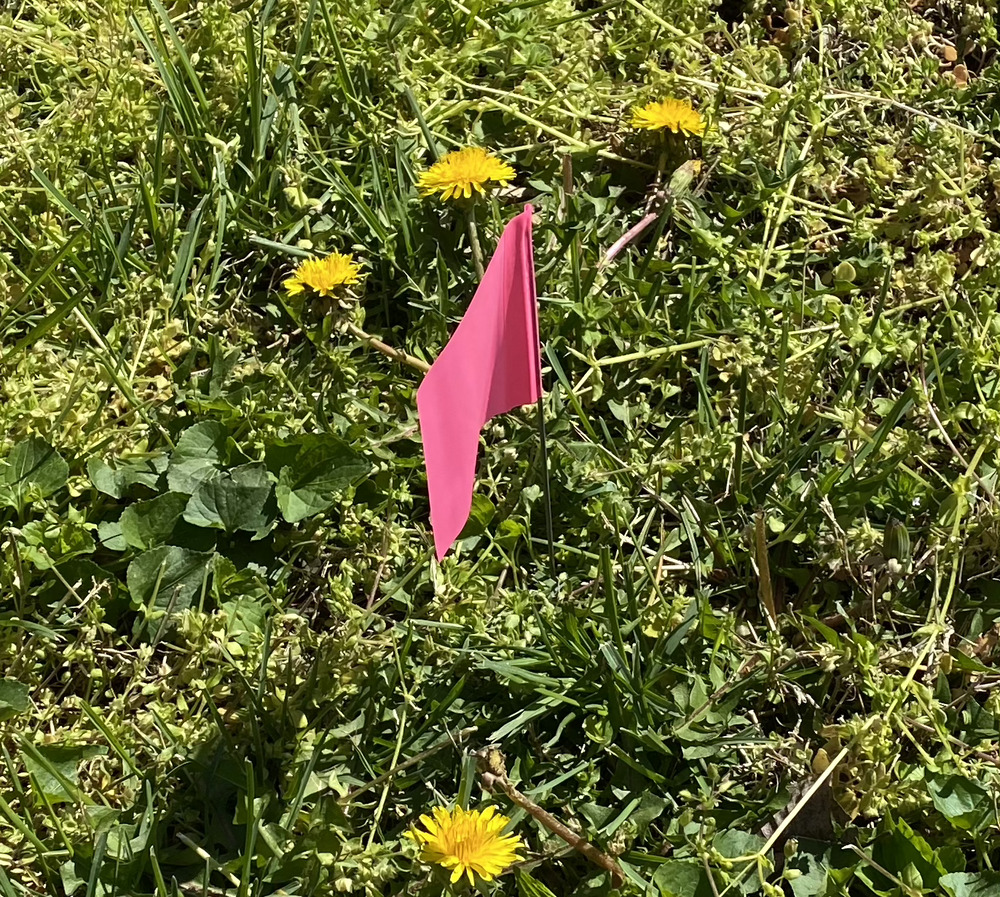

# Checklist

## Install and water new trees

    1. Remove the plastic from the 30 small trees and place it in the trash.
        [small trees]
    1. Fold and place the cardboard in the recycling.
        [cardboard and recycling]
    1. Markers have been installed. Use the shovels to dig a hole of 1ft * 1ft * 1ft under each marker. 
    
    
    1. Install the plants.
    1. Put the markers next to the plants so that they are visible.
        [Photo of marker next to plant]
    1. Water the new trees very generously.
    1. Water the other marked plants generously.
    1. Place the hose near the bins where the trees were.
        [awning]
