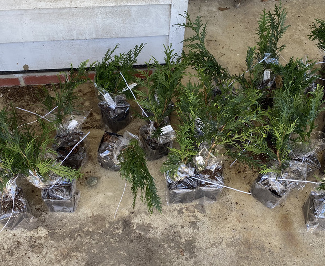
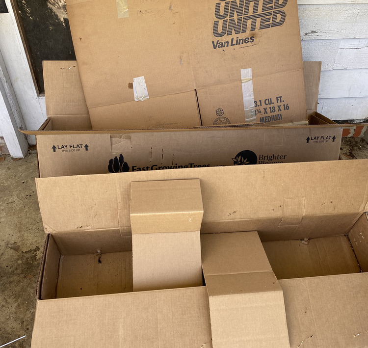
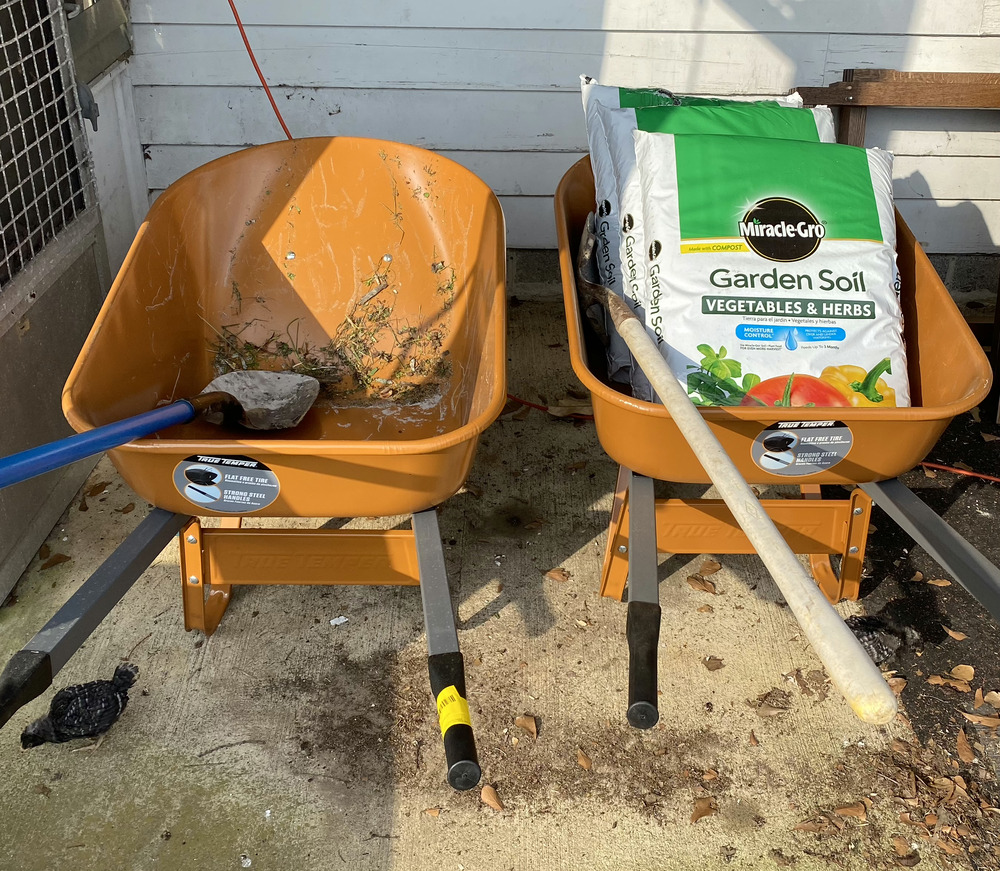
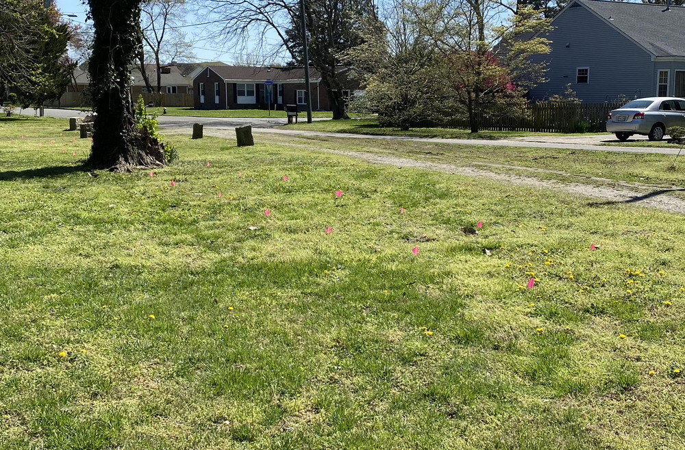
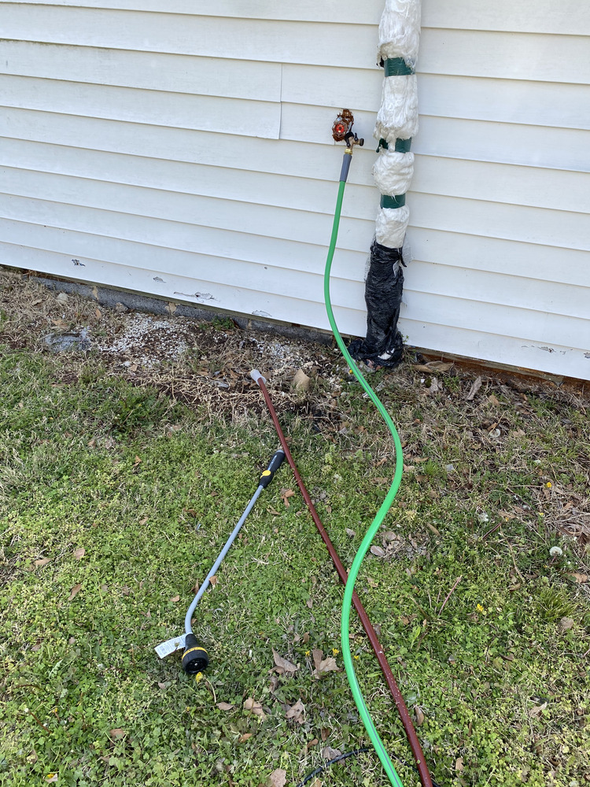

# Checklist

## Install and water new trees

1. Remove the plastic from the 30 small trees and place it in the trash.

1. Fold and place the cardboard in the trash.

1. There are two wheel barrows, one for new soil, and one for old soil.

1. Take the wheelbarrows to the property entrance at the **pink flags**.

1. **Pink flags** have been installed. Use the shovels to dig a hole of `1ft * 1ft * 1ft` under each marker and install the plants.

1. Keep the markers next to the plants so theyre visible.
1. Water the new trees very generously.

1. Place the hose near the bins where the trees were.
